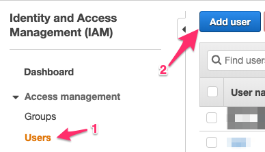

## Setup AWS Account

To automate the EC2 provisioning using Terraform, we are going to setup a dedicated IAM user:
- Login to your AWS Console.
- In your AWS Console choose IAM. In the IAM dashboard choose "Users", then click on "Add user".

- Then set the user name. In this case I set the user as "***ec2-automate***" and the Access type as "***Programmatic access***".

- Next, we attach the policy to the new user "***ec2-automate***". We give the "***AmazonEC2FullAccess***" policy to this user.

    

    Then click "_Next: Tags_". In the "Tags" page we just click "_Next: Review_".

- In the review page, we can review our choice for the user and its policy.

If everything is correct, we can create the user by clicking the "_Create User_" button.

- If the user is created successfully, you will see the "Success" message, and you will be shown the "_Access key ID_" and the "_Secret access key_". 

    
**Please remember to take note of these two information (Access key ID and Secret access key). If you loose them, you will never be able to access the user account.**

- After you click the "_Close_" button, you will go back to the IAM dashboard and you will see the newly created user in the dashboard.

    

At this point, our AWS account setup is complete. Now we need to test access our AWS from the Terraform.