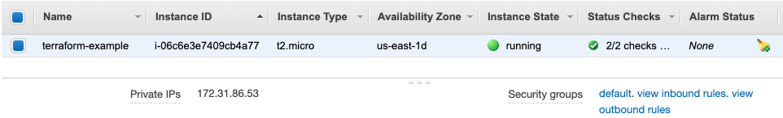
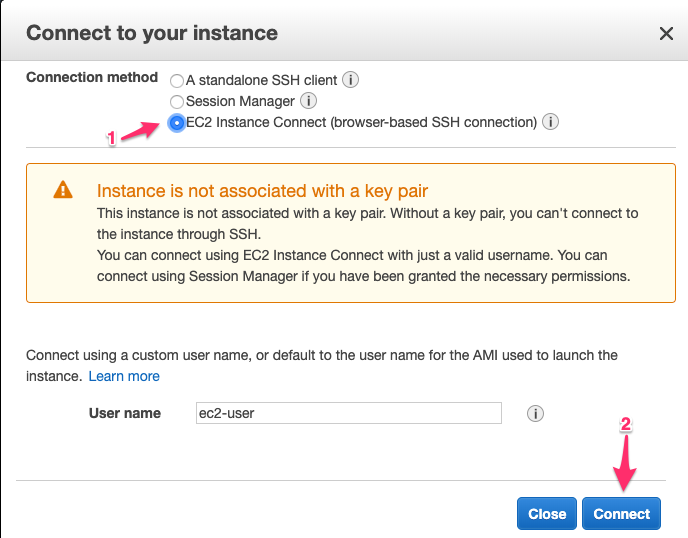
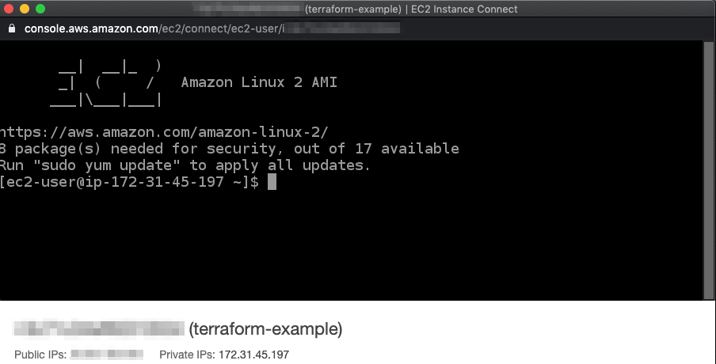

## Enabling SSH Access in the Simple EC2 Instance

The simple EC2 instance that we have created so far can't be accessed using SSH.

Our default security group is used by our EC2 instance



### Define the SSH Security Group
To enable SSH access, we need to define the virtual firewall (security group) to control the inbound and outbound traffic for SSH access.

Below is a sample of the AWS security group resource definition for allowing inbound and outbound SSH access:
```
resource "aws_security_group" "allow_ssh" {
	name = "allow ssh"

	ingress {
		from_port = 22
		to_port = 22
		protocol = "tcp"
		cidr_blocks = ["0.0.0.0/0"]
	}

	egress {
		from_port = 0
		to_port   = 0
		protocol  = "-1"
		cidr_blocks = ["0.0.0.0/0"]
	}
}
```

The ingress define the inbound rules. In this case we define the following:
- Protocol: TCP
- The start port: 22
- The end port: 22
- List of CIDR blocks: 0.0.0.0/0 (all IP address)

The egress define the outbound rules. In this case we define the following:
- Protocol: -1 (all)
- The start port: 0
- The end port: 0
- List of CIDR blocks: 0.0.0.0/0 (all IP address)

Because we set the protocol as "-1", we need to set the `from_port` and `to_port` to *0*.

### Using the SSH Security Group

Simply creating the security group is not enough to make our EC2 accessible via SSH. We also need to tell the EC2 instance to use the security group by passing the security group name and attribute to the `aws_security_group` argument:

```
security_groups = [aws_security_group.allow_ssh.name]
```

The full Terraform config can be found at ([main.cf](../configs/simple-ssh/main.tf)).

### Implementing the Security Group 

After adding the security group, we can view the Terraform execution plan:
```
terraform plan
```

If everything is OK, we can apply it using the following command:
```
terraform apply
```

### Checking the SSH Access

In the EC2 dashboard, we can see that the instance now has `allow_ssh` security group.

To test the allow_ssh security group, we will connect to the instance using web browser:
- Select the EC2 instance.
- Click the `Connect` button

In the `Connection Method` choose `EC2 Instance Connect (browser-based SSH connection)`


After that, we will be shown the following console:


We've managed to allow SSH access to our EC2 instance.

In the future articles, we will see other use cases of managing EC2 using Terraform.