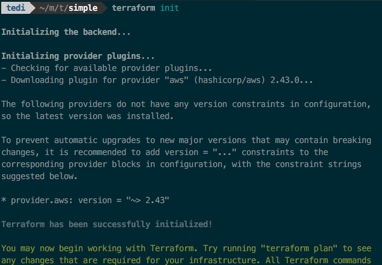
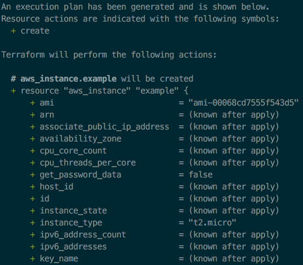
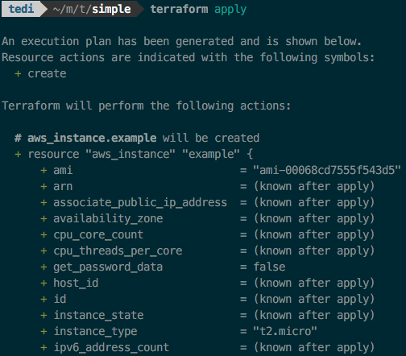
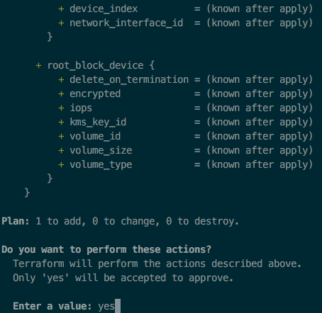
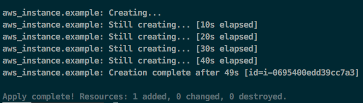
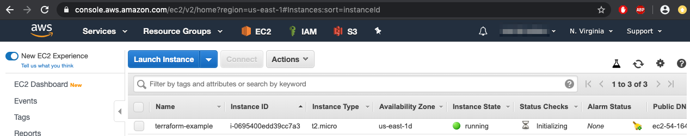

## Provision a Simple EC2 Instance

In this section, we will use Terraform to provision a simple EC2 instance. 

Before you can use Terraform properly, you need to export the "_Access key ID_" and the "_Secret access key_".

Here are the steps to export those values for different shells.

### Bash

In Bash shell, you can export the Key ID and Access Key values using the following commands:
```
export AWS_ACCESS_KEY_ID=[YOUR_AWS_ACCESS_KEY_ID]
export AWS_SECRET_ACCESS_KEY=[YOUR_AWS_SECRET_ACCESS_KEY]
```

### Fish

In Fish shell, you can save  those values in the `.config/fish/config.fish` file:
```
set -xU AWS_ACCESS_KEY_ID [YOUR_AWS_ACCESS_KEY_ID]
set -xU AWS_SECRET_ACCESS_KEY [YOUR_AWS_SECRET_ACCESS_KEY]
```

Here are our requirements for the EC2:
- AWS Region: US-East-1
- Instance type: "_t2.micro_"
- AMI v2
- Name: terraform-example

Below are the Terraform code for our requirements above ([main.cf](../configs/simple/main.tf)):
```
provider "aws" {
	region = "us-east-1"
}

resource "aws_instance" "example" {
	ami = "ami-00068cd7555f543d5"
	instance_type = "t2.micro"

	tags = {
		Name = "terraform-example"
	}
}
```

We created a folder named `simple` and save the code to `main.cf` file.

We go to that folder and initializing the Terraform backend:
```
cd simple
terraform init
```


Then we check our code by viewing the Terraform execution plan:
```
terraform plan
```


If everything looks OK, we can deploy our code to the AWS, we just run the `apply`  command:
```
terraform apply
```


Then we need to type "Yes" to confirm our action.



We may need to wait for some time before the server is created in the AWS.



After the Terraform finished creating the server, we can verify it by checking the EC2 dashboard.



The server is listed and running. At this moment, probably there is nothing you can do with this server. In the next article, we will continue our journey using Terraform to setup more meaningful server.

Don't forget to stop the instance after you're done with it. 

If you want to destroy the instance, you can use the following command:
```
terraform destroy
```